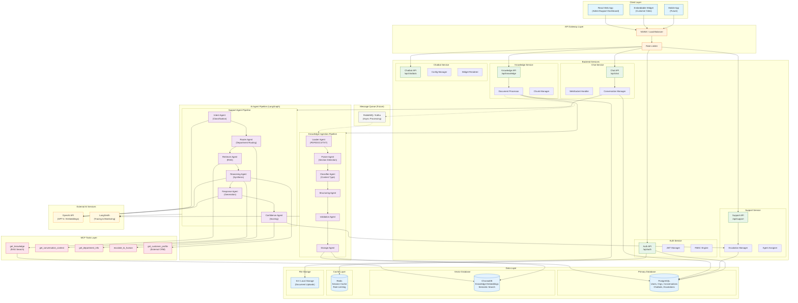

```mermaid
flowchart TB
    subgraph Clients["Client Layer"]
        WebApp["React Web App<br/>(Admin/Support Dashboard)"]
        Widget["Embeddable Widget<br/>(Customer Sites)"]
        MobileApp["Mobile App<br/>(Future)"]
    end

    subgraph Gateway["API Gateway Layer"]
        NGINX["NGINX / Load Balancer"]
        RateLimiter["Rate Limiter"]
    end

    subgraph Backend["Backend Services"]
        subgraph AuthService["Auth Service"]
            AuthAPI["Auth API<br/>/api/auth"]
            JWT["JWT Manager"]
            RBAC["RBAC Engine"]
        end
        
        subgraph ChatService["Chat Service"]
            ChatAPI["Chat API<br/>/api/chat"]
            WSHandler["WebSocket Handler"]
            ConversationMgr["Conversation Manager"]
        end
        
        subgraph KnowledgeService["Knowledge Service"]
            KnowledgeAPI["Knowledge API<br/>/api/knowledge"]
            DocProcessor["Document Processor"]
            ChunkManager["Chunk Manager"]
        end
        
        subgraph SupportService["Support Service"]
            SupportAPI["Support API<br/>/api/support"]
            EscalationMgr["Escalation Manager"]
            AgentAssigner["Agent Assigner"]
        end
        
        subgraph ChatbotService["Chatbot Service"]
            ChatbotAPI["Chatbot API<br/>/api/chatbots"]
            ConfigManager["Config Manager"]
            WidgetRenderer["Widget Renderer"]
        end
    end

    subgraph AgentPipeline["AI Agent Pipeline (LangGraph)"]
        subgraph SupportPipeline["Support Agent Pipeline"]
            IntentAgent["Intent Agent<br/>(Classification)"]
            RouterAgent["Router Agent<br/>(Department Routing)"]
            RetrieverAgent["Retriever Agent<br/>(RAG)"]
            ReasoningAgent["Reasoning Agent<br/>(Synthesis)"]
            ResponseAgent["Response Agent<br/>(Generation)"]
            ConfidenceAgent["Confidence Agent<br/>(Scoring)"]
        end
        
        subgraph KnowledgePipeline["Knowledge Ingestion Pipeline"]
            LoaderAgent["Loader Agent<br/>(PDF/DOCX/TXT)"]
            ParserAgent["Parser Agent<br/>(Section Detection)"]
            ClassifierAgent["Classifier Agent<br/>(Content Type)"]
            StructuringAgent["Structuring Agent"]
            ValidationAgent["Validation Agent"]
            StorageAgent["Storage Agent"]
        end
    end

    subgraph MCPLayer["MCP Tools Layer"]
        GetKnowledge["get_knowledge<br/>(RAG Search)"]
        GetContext["get_conversation_context"]
        GetDepartment["get_department_info"]
        EscalateTool["escalate_to_human"]
        CRMTool["get_customer_profile<br/>(External CRM)"]
    end

    subgraph ExternalAI["External AI Services"]
        OpenAI["OpenAI API<br/>(GPT-4 / Embeddings)"]
        LangSmith["LangSmith<br/>(Tracing & Monitoring)"]
    end

    subgraph DataLayer["Data Layer"]
        subgraph PrimaryDB["Primary Database"]
            PostgreSQL[(PostgreSQL<br/>Users, Orgs, Conversations<br/>Chatbots, Escalations)]
        end
        
        subgraph VectorDB["Vector Database"]
            ChromaDB[(ChromaDB<br/>Knowledge Embeddings<br/>Semantic Search)]
        end
        
        subgraph Cache["Cache Layer"]
            Redis[(Redis<br/>Session Cache<br/>Rate Limiting)]
        end
        
        subgraph FileStorage["File Storage"]
            S3["S3 / Local Storage<br/>(Document Uploads)"]
        end
    end

    subgraph MessageQueue["Message Queue (Future)"]
        RabbitMQ["RabbitMQ / Kafka<br/>(Async Processing)"]
    end

    %% Client Connections
    WebApp --> NGINX
    Widget --> NGINX
    MobileApp --> NGINX
    NGINX --> RateLimiter

    %% Gateway to Services
    RateLimiter --> AuthAPI
    RateLimiter --> ChatAPI
    RateLimiter --> KnowledgeAPI
    RateLimiter --> SupportAPI
    RateLimiter --> ChatbotAPI

    %% Service Interactions
    ChatAPI --> ConversationMgr
    ConversationMgr --> SupportPipeline
    KnowledgeAPI --> DocProcessor
    DocProcessor --> KnowledgePipeline
    SupportAPI --> EscalationMgr

    %% Agent Pipeline Flow
    IntentAgent --> RouterAgent
    RouterAgent --> RetrieverAgent
    RetrieverAgent --> ReasoningAgent
    ReasoningAgent --> ResponseAgent
    ResponseAgent --> ConfidenceAgent
    ConfidenceAgent --> EscalationMgr

    %% Knowledge Pipeline Flow
    LoaderAgent --> ParserAgent
    ParserAgent --> ClassifierAgent
    ClassifierAgent --> StructuringAgent
    StructuringAgent --> ValidationAgent
    ValidationAgent --> StorageAgent

    %% MCP Tool Usage
    RetrieverAgent --> GetKnowledge
    ReasoningAgent --> GetContext
    RouterAgent --> GetDepartment
    ConfidenceAgent --> EscalateTool
    ReasoningAgent --> CRMTool

    %% External AI
    IntentAgent --> OpenAI
    ReasoningAgent --> OpenAI
    ResponseAgent --> OpenAI
    SupportPipeline --> LangSmith
    KnowledgePipeline --> LangSmith

    %% Data Connections
    GetKnowledge --> ChromaDB
    StorageAgent --> ChromaDB
    StorageAgent --> PostgreSQL
    ConversationMgr --> PostgreSQL
    EscalationMgr --> PostgreSQL
    AuthAPI --> PostgreSQL
    AuthAPI --> Redis
    DocProcessor --> S3

    %% Message Queue
    DocProcessor -.-> RabbitMQ
    RabbitMQ -.-> KnowledgePipeline

    classDef client fill:#e1f5fe,stroke:#01579b
    classDef gateway fill:#fff3e0,stroke:#e65100
    classDef service fill:#e8f5e9,stroke:#2e7d32
    classDef agent fill:#f3e5f5,stroke:#7b1fa2
    classDef mcp fill:#fce4ec,stroke:#c2185b
    classDef external fill:#fff8e1,stroke:#f57f17
    classDef data fill:#e3f2fd,stroke:#1565c0
    classDef queue fill:#f5f5f5,stroke:#616161

    class WebApp,Widget,MobileApp client
    class NGINX,RateLimiter gateway
    class AuthAPI,ChatAPI,KnowledgeAPI,SupportAPI,ChatbotAPI service
    class IntentAgent,RouterAgent,RetrieverAgent,ReasoningAgent,ResponseAgent,ConfidenceAgent,LoaderAgent,ParserAgent,ClassifierAgent,StructuringAgent,ValidationAgent,StorageAgent agent
    class GetKnowledge,GetContext,GetDepartment,EscalateTool,CRMTool mcp
    class OpenAI,LangSmith external
    class PostgreSQL,ChromaDB,Redis,S3 data
    class RabbitMQ queue
```
